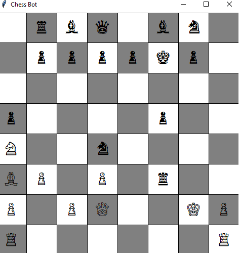
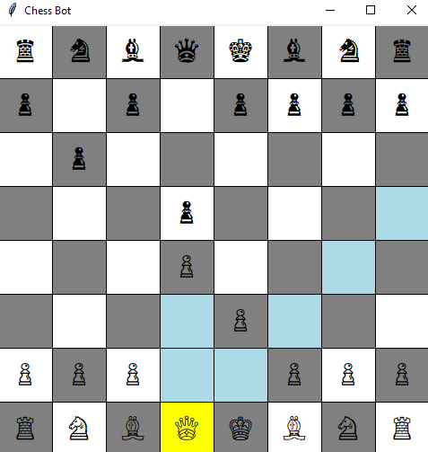

# Chess Bot

A simple chess game with an AI opponent implemented in Python. The AI uses the Minimax algorithm with alpha-beta pruning to decide its moves. This project demonstrates fundamental concepts in game development, artificial intelligence algorithms, and GUI programming.

<table>
  <tr>
    <td></td>
    <td></td>
  </tr>
</table>

## Table of Contents

- [Features](#features)
- [Installation](#installation)
- [How to Run](#how-to-run)
- [How to Play](#how-to-play)
- [Algorithm Description](#algorithm-description)
- [Project Structure](#project-structure)
- [Screenshots](#screenshots)
- [License](#license)
- [Acknowledgments](#acknowledgments)
- [Contact](#contact)

## Features

- **Play Against AI:** Challenge an AI opponent that makes decisions based on the Minimax algorithm.
- **Minimax Algorithm with Alpha-Beta Pruning:** The AI efficiently evaluates moves to a certain depth.
- **Simple GUI:** User-friendly graphical interface built with Tkinter.
- **Highlight Possible Moves:** When you select a piece, valid moves are highlighted.
- **Game Over Detection:** Detects checkmate and stalemate conditions, displaying appropriate messages.

## Installation

### Prerequisites

- **Python 3.x:** You can download it from [python.org](https://www.python.org).
- **Tkinter:** This is usually included with Python. If not, you can install it through your operating system's package manager or follow instructions specific to your environment.

### Clone the Repository

1. Download the repository from [GitHub](https://github.com/yourusername/chess-bot).
2. Extract the files to your desired location.

## How to Run

Navigate to the project directory and run the main script:

1. Open your terminal or command prompt.
2. Navigate to the directory where the files were extracted.
3. Run the script `chess_ui.py` using Python.
   
## How to Play
# Upon running the script, a window will appear displaying the chessboard.
1. **Select a Piece:** Click on one of your pieces (white pieces). The selected piece will be highlighted, and all possible moves will be indicated.
2. **Make a Move:** Click on one of the highlighted squares to move the selected piece there.
3. **AI's Turn:** After you make a move, the AI will calculate and make its move automatically.
4. **Game Over:** The game will detect checkmate or stalemate conditions. A message box will inform you of the result.
5. **Restarting:** Close and rerun the script to start a new game.

## Algorithm Description

### Minimax Algorithm

The AI uses the Minimax algorithm with alpha-beta pruning to decide its moves:

- **Minimax:** A recursive algorithm used for decision-making and game theory. It simulates all possible moves, assuming that the opponent plays optimally, and selects the move that maximizes the AI's minimum gain (hence "minimax").
- **Alpha-Beta Pruning:** An optimization technique for the Minimax algorithm. It reduces the number of nodes evaluated by pruning branches that cannot possibly influence the final decision.

#### How It Works in This Project

- **Move Generation:** The AI generates all possible legal moves for itself and the opponent.
- **Evaluation Function:** A simple function that assigns scores to board positions based on material count (piece values).
- **Depth Limitation:** The search depth is limited (e.g., 2 plies) to keep computation time reasonable.
- **Opening Book:** The AI uses a small set of predefined opening moves for the initial phase of the game.

#### Move Generation

The engine generates all possible moves for the current player by iterating over all pieces and applying the movement rules for each piece type.

- **Piece Movement Rules:**
  - **Pawn:** Moves forward one square, with the option to move two squares from the starting position. Captures diagonally.
  - **Knight:** Moves in an L-shape: two squares in one direction and then one square perpendicular.
  - **Bishop:** Moves any number of squares diagonally.
  - **Rook:** Moves any number of squares horizontally or vertically.
  - **Queen:** Combines the movement of the rook and bishop.
  - **King:** Moves one square in any direction.

#### Evaluating Board States

The evaluation function calculates a score based on the material balance:

- Each piece is assigned a value:
  - Pawn: 1
  - Knight: 3
  - Bishop: 3
  - Rook: 5
  - Queen: 9
  - King: 100 (arbitrary high value)
- The AI sums up the values of its pieces and subtracts the values of the opponent's pieces.

#### Alpha-Beta Pruning

- **Alpha:** The best value that the maximizer currently can guarantee at that level or above.
- **Beta:** The best value that the minimizer currently can guarantee at that level or above.
- **Pruning:** If the minimizer's best option is worse than the maximizer's current best, further evaluation of that branch is unnecessary.

### Limitations

- **Search Depth:** Limited to two moves ahead due to computational constraints.
- **Simplistic Evaluation:** Does not consider advanced positional play, control of the center, pawn structure, or other strategic elements.

## Project Structure

- **chess_ui.py:** The main script that runs the game and handles the graphical user interface.
- **chess_engine.py:** Contains the game logic, rules, and state management.
- **chess_ai.py:** Implements the AI opponent using the Minimax algorithm with alpha-beta pruning.
- **images/:** Contains images used in the README.
